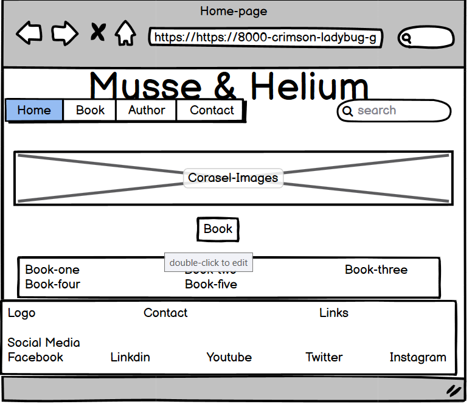
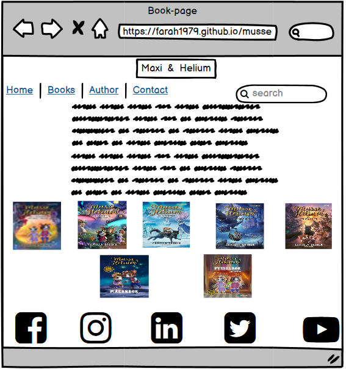
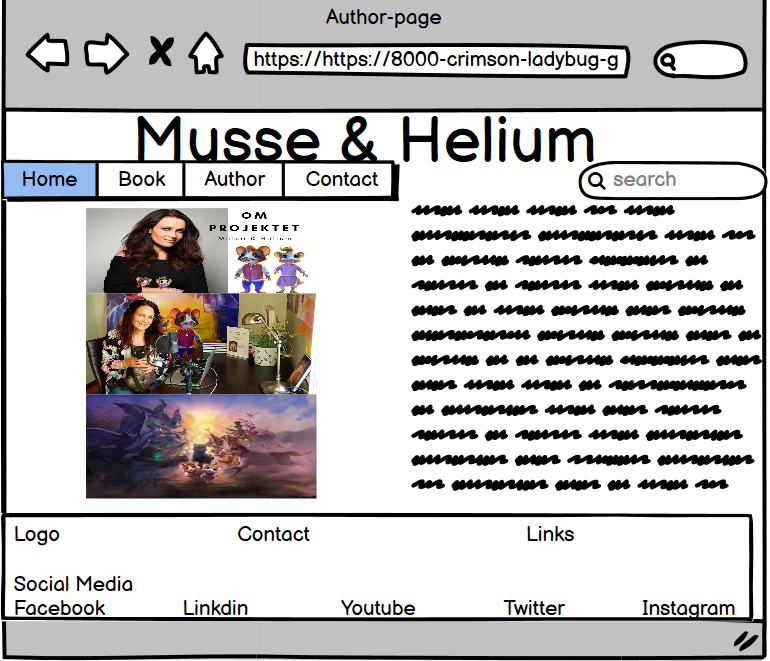
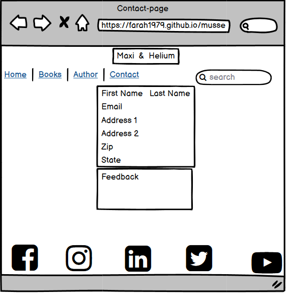
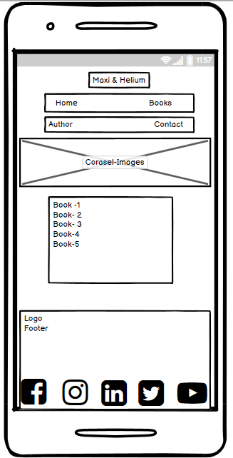
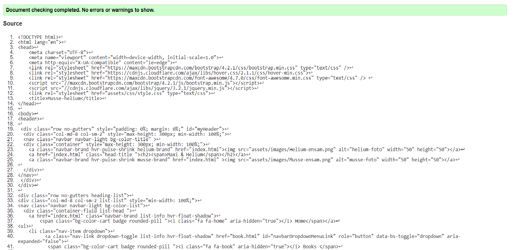
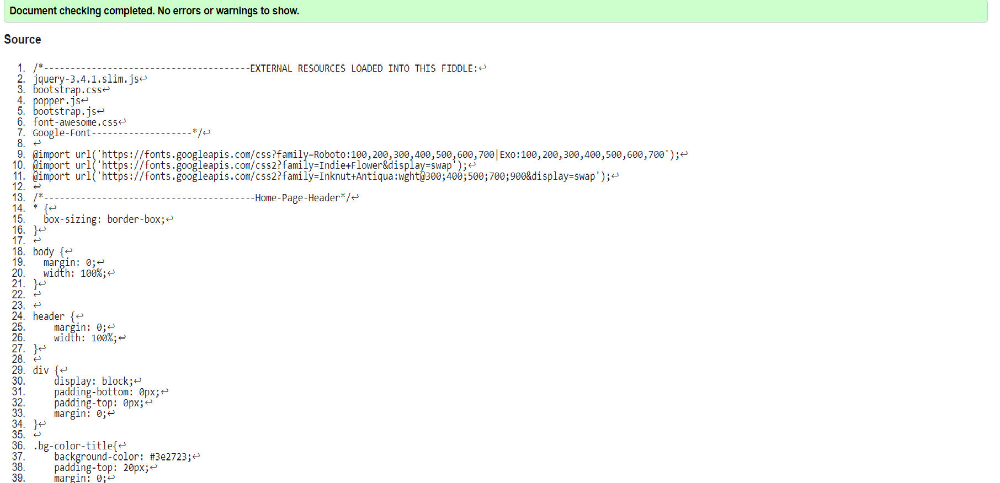

# **Code Institute Milestone First Project: Maxi & Helium**
## Table of contents
* [General info](#general-info)
* [Scope](#scope)
* [UserExperience](#userexperience)
* [Technologies](#technologies)
* [Features](#features)
* [Testing](#testing)
* [Deployment](#deployment)
* [Credits](#credits)

# General Info
## Project Introduction
### The purpose and goals of building the project idea
- The purpose of my small project is to clarify one of the problems that may affect any child at this time, and this problem is dyslexia.
- The first goal is to reach, touch, and embrace each child through reading. Reading is the best way to communicate with children.
- The second goal is to give a vivid and tangible example of the famous writer Camilla Narng, who was able to become a writer of fictional 
stories for children and communicate with them through her books despite the dyslexia that she suffered from when his child 
was in school, but she is one of the many famous characters who was able To prove that with will and challenge it is possible 
to reach the highest positions.

- The third goal of building the Maxi and Helium Project was that I wanted to communicate with each child and try to help them. 
As these two mice wanted to deliver a message to the children, which is that no matter what difficulties and problems you face, 
try to solve and discuss them with your family and brothers, and always be stronger, so life is worth fighting and struggling.
 
 

[Back to Table of contents](#table-of-contents)

# Scope
This is my first project and its goal is to learn and creating a responsive website, that is mobile first.
As for my project,I built a website that contains seven different pages and used many languages and technologies in it, which I will release later.
The project is based on four main pages, which are the Home page, Book page, Author page, and finally Contact page which Allow us to communicate with our readers or visitors.
I have tested my project through the responsivedesign and this was the result

[amiresponsivedesign](http://ami.responsivedesign.is/)

[Back to Table of contents](#table-of-contents)

# UserExperience 
## User stories
-  First-time visitor goals
    1. Building an integrated and simple website for easy navigate between its sections, which suits children, as the content is suitable for young age groups between 3 and 12 years old.
    2. As a first time visitor, I would like to see a meaningful and useful site, to which parents and children would love to return.
    
- Returning Visitor Goals
    1. The user will come back several times to benefit from the targeted educational content.
    2. To register for our newsletter to stay informed of any current new changes.
    3. The user can make any comments that the owner can use to update the existing data or add new data that the reader can benefit from it.

## Design
### Colour Scheme
 - I used a group of colors between brown to beige, derived from nature, earth, and trees /nature's colors suggest psychological 
comfort for the visitor, which makes him want to come constantly.
- I used the project colors with the help of  [COLOR TOOL](https://material.io/resources/color/#!/?view.left=1&view.right=0&secondary.color=6A1B9A&primary.color=4E342E)

### Typography
- Roboto font is the main font used throughout the entire website with Sans Serif as the backup font in case the font has not been 
imported properly to the site for any reason. I have used two other fonts *Indie Flowe* and *Inknut Antiqua* to beautify and design the pages and attract children without feeling bored 
by using one type of font in the whole project.All the fonts I used on the pages are clean fonts that are used frequently in programming, 
so it is attractive and appropriate.
- The source for the inspired fonts is [Google Fonts](https://fonts.google.com/)

### Imagery
Imagery is important. All the images were obtained by Google Researcher, which is for the Maxi and Helium story books, 
which are present on all pages of the project and for the home page I used A slideshow component for cycling through elements—images by using Bootstrap 4 and the idea was the developer idea by getting help from the example bellow code

                      div id="carouselExampleFade" class="carousel slide carousel-fade" data-bs-ride="carousel" data-bs-pause="hover"  data-interval="10000" 
and I have used this website [Unspalsh.com](www.unsplash.com)  and have chosen a background Image in my Contact page.

### Wireframes
Home Page Wireframe -

Book page Wireframe - 

Author page Wireframe- 

Contact Page Wireframe - 

Mobile Wireframe - 

[Back to Table of contents](#table-of-contents)

# Technologies
## Languages Used
 - HTML5
 - CSS3

## Frameworks, Libraries & Programs Used

 1- Bootstrap 4.2.1:
  - Bootstrap was used to assist with the responsiveness and styling of the website.[Bootstrap](https://getbootstrap.com/)

 2- Hover.css:
  - Hover.css was used on the Head bar, navication menu, all the links in the Home page to add the float transition while being hovered over.[Hover.css](https://ianlunn.github.io/Hover/)
  and download the link in the stracture of the index.html in the Head.

 3- Google Fonts:
  - Google fonts were used to import the *Roboto*, *Indie Flowe* and *Inknut Antiqua*  font into the style.css file which is used on all pages throughout the project.

 4- Font Awesome:
  - Font Awesome was used on the header and the footer which seems in all pages throughout the website to add icons for design and UX purposes.[Font Awesome](https://fontawesome.com/v4.7.0/icon/commenting-o)

 5- jQuery:
  - jQuery came with Bootstrap 4 to make the navbar responsive but was also used for the smooth scroll function in JavaScript.

 6- Git / GitHub:
  - git/gihub was used to code the site, push my code to the github to store my projects and publish my website by GitHub pages.

 7- Photoshop Opera:
  - I have installd the Opera Photoshop for used to create the logo, resizing images and editing photos for the website.

 8- Paint:
  - I have used Paint Program to crob and resize the Pr scr images.

 9- Soda Pdf: 
  - Soda PDF is a software family of applications used to open, view, create, convert, edit, secure and share portable document formats and
    I have installd it for converts my file from Microsoft Word to Pdf and reload it in my project. 

 8- Balsamiq wireframes:
  - Balsamiq was used to create the wireframes during the design process.

[Back to Table of contents](#table-of-contents)

# Features

- Responsive on all device sizes 
  - Desktop
1600x992px scaled down to scale(0.3181)
  - Laptop
1280x802px scaled down to scale(0.277)
  - Tablet
768x1024px scaled down to scale(0.219)
  - Mobile
320x480px scaled down to scale(0.219))
- Interactive elements

[Back to Table of contents](#table-of-contents)

# Testing

I have used the **W3C Coding Validator** and the **W3C CSS Validator** on my project to validate every page of 
the project and have been using the validator throughout my steps to ensure
There were no syntax errors in the project. It has been designed to suit different browsers, including *Google Chrome*, 
*Internet 10* and *Avast Secure Browser*, in addition to *mobile sizes and iPad browsers*.

- W3C Markup Validator - Results 

- W3C CSS Validator - Results    

[Back to Table of contents](#table-of-contents)

# Deployment
## GitHub Pages

My project was deployed to GitHub Pages using the following steps:

1- Log in to GitHub and locate the GitHub Repository

2- At the top of the Repository (not top of page), locate the "Settings" Button on the menu.

3- Scroll down the Settings page until you locate the "GitHub Pages" Section.

4- Under "Source", click the dropdown called "None" and select "Master Branch".

5- The page will automatically refresh.

6- Scroll back down through the page to locate the now published site link in the "GitHub Pages" section.

[Back to Table of contents](#table-of-contents)

# Credits
## Code

- [Bootstrap 4.2.1](https://getbootstrap.com/)
  - Bootstrap Grid: used to easy and smoothy build the main stractures of my project.
  - Bootstrap components: I have used many components to create a navigation menu, place 
    the correct images in their place with their linear contents ... and build the footer parts.

- [JavaScript](https://getbootstrap.com/docs/5.0/getting-started/javascript/)
  - i have used J-scripts to run and activate animations.

- [w3schools](https://www.w3schools.com/)
  - It is a very effective and useful site for beginners, even intermediate and advanced programming,
   as it helps a lot and makes many things easy for any programmer or developer to forget any code and this 
   is with regard to the features and components of **Html5** and **Css3**

- [StackOverflow](https://stackoverflow.com/questions)
  - This site has helped me a lot in solving many problems and difficulties that I had encountered during the 
  creation of my project, by reading and seeing the problems and solutions previously proposed by old developers.

- [Code Institute Lectures](https://codeinstitute.net/)
  - I was referring to some of the lectures during the construction of the project to remind some data that I had forgotten

## Content & Media

  - All handwritten statements and bookS names are inspired by the master site of author *Camilla Brinck*.
  - All images for fatacy stories are taken by Google Image Researcher and from [Unspalsh.com](www.unsplash.com).
  - All information about the author has been reproduced through interviews and Wikipedia.

## Feedback

All feedback welcomed.

## Acknowledgements
### I thank my mentor Akshat Garg, for all the directions.

[Back to Table of contents](#table-of-contents)

